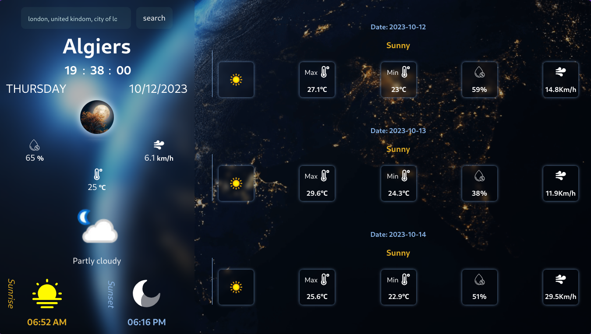
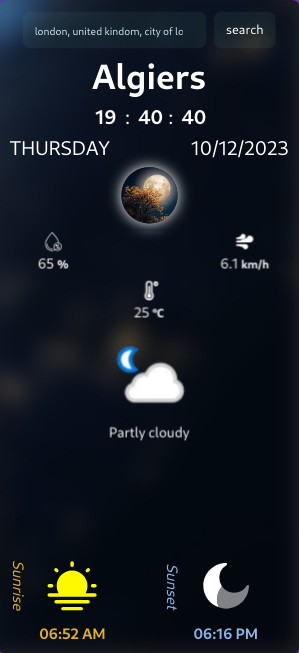

# Weather Forecast App with Svelte

## Description

This project is a weather forecast application developed using Svelte. It enables users to check the current weather and weekly forecasts for cities or countries of their choice.

## Implemented Features

- **Weather Lookup**: Users can enter the name of a city or country to view the current weather and forecast for the upcoming week.
- **Responsive Design**: The application is fully responsive, ensuring a seamless experience across various devices.

## How it Works

- Enter the name of the city or country in the search bar and click "Search" to retrieve the weather information.
- The application displays the current weather conditions along with the forecast for the next seven days.

## Technologies Used

- HTML
- CSS
- JavaScript (Svelte Framework)

## Screenshots

Here are some screenshots showcasing the application in action!

## Links

- **GitHub Repository:** [Repository Link](https://github.com/xabi1000/weather_app)
- **Live Application:** [App Link](https://your-app-url.com)

## Acknowledgments

I would like to express my gratitude to DevChallenges.io for providing an engaging platform to challenge my frontend development skills and enhance my expertise in the Svelte framework. Creating this weather application was a delightful experience, and I hope users find it helpful and user-friendly.

Thank you for exploring my Weather Forecast App!

Warm regards,

[XABI CODE]

---

_Note: This summary provides an overview of the project. For a more detailed exploration of the code and implementation, I encourage you to dive into the GitHub repository._
